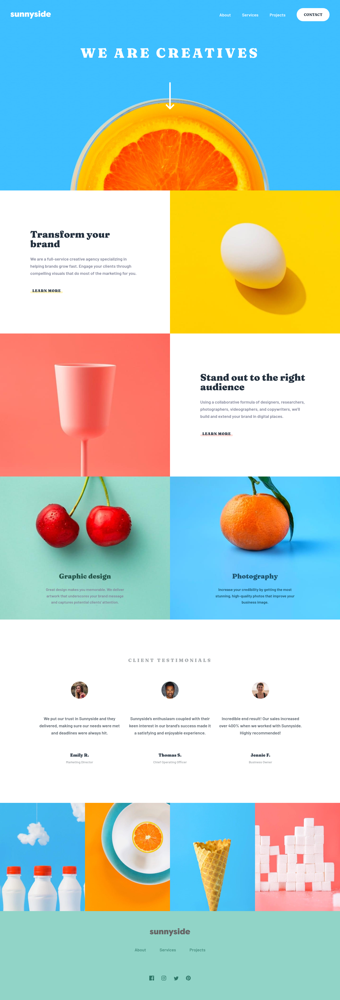
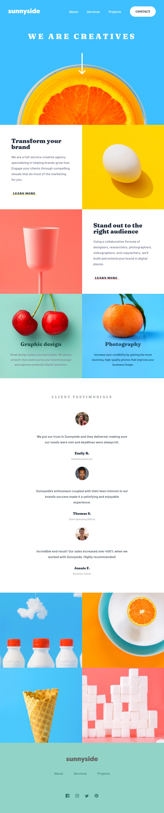
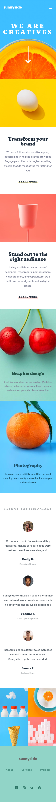
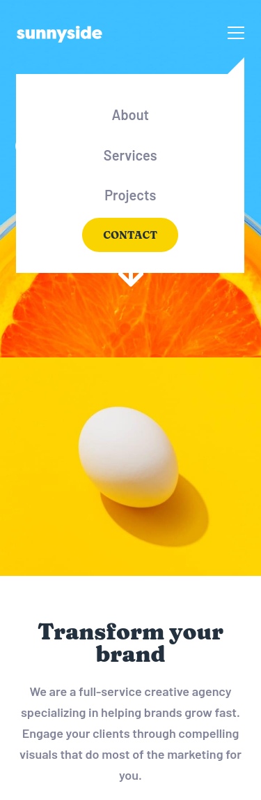

# Frontend Mentor - Sunnyside agency landing page solution

This is a solution to the [Sunnyside agency landing page challenge on Frontend Mentor](https://www.frontendmentor.io/challenges/sunnyside-agency-landing-page-7yVs3B6ef). Frontend Mentor challenges help you improve your coding skills by building realistic projects.

## Table of contents

- [Overview](#overview)
  - [The challenge](#the-challenge)
  - [Screenshot](#screenshot)
  - [Links](#links)
- [My process](#my-process)
  - [Built with](#built-with)
  - [What I learned](#what-i-learned)
  - [Useful resources](#useful-resources)
- [Author](#author)

## Overview

### The challenge

Users should be able to:

- View the optimal layout for the site depending on their device's screen size
- See hover states for all interactive elements on the page

### Screenshot

  
Desktop

  
Tablet

  
Mobile

### Links

- Solution URL: [Frontend Mentor Solution](https://www.frontendmentor.io/solutions/sunnyside-agency-landing-page-gulp-sass-bem-html-grid-flexbox-a5lzGMSAr)
- Live Site URL: [Github Pages](https://rzvr.github.io/sunnyside-agency-landing-page/)

## My process

### Built with

- CSS variable
- SASS
- BEM
- Flexbox
- Gulp

### What I learned

In this challenge, I studied and updated my knowledge of the project structure, building a project with gulp, a more conscious approach to responsive design.

### Useful resources

- [Youtube](https://www.youtube.com/user/KepowOb) - Great channel about HTML and CSS.
- [Ninja Units](https://www.ninjaunits.com/) - A site where you can convert all possible and necessary in the creation of sites units.

## Author

- Github - [rzvr](https://github.com/rzvr)
- Codewars - [rzvr](https://www.codewars.com/users/rzvr)
- LinkedIn - [Roman Zvir](https://www.linkedin.com/in/roman-zvir-8a4394214)
- Frontend Mentor - [rzvr](https://www.frontendmentor.io/profile/rzvr)
